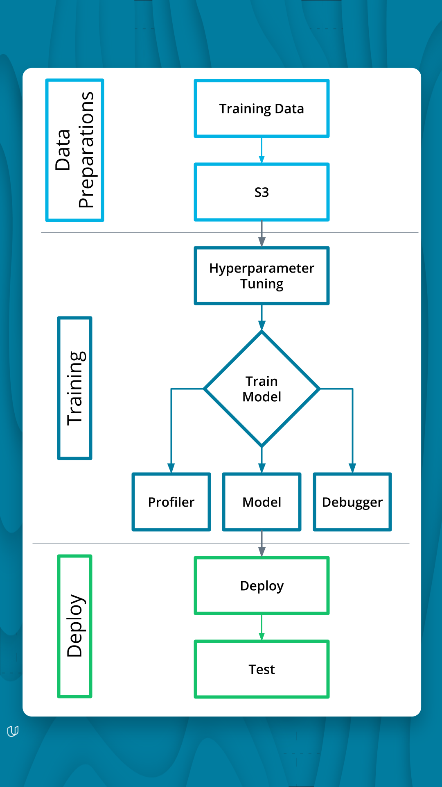
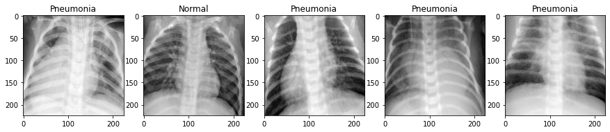
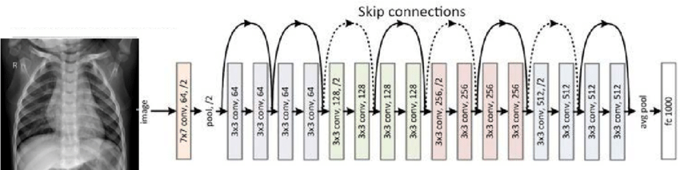
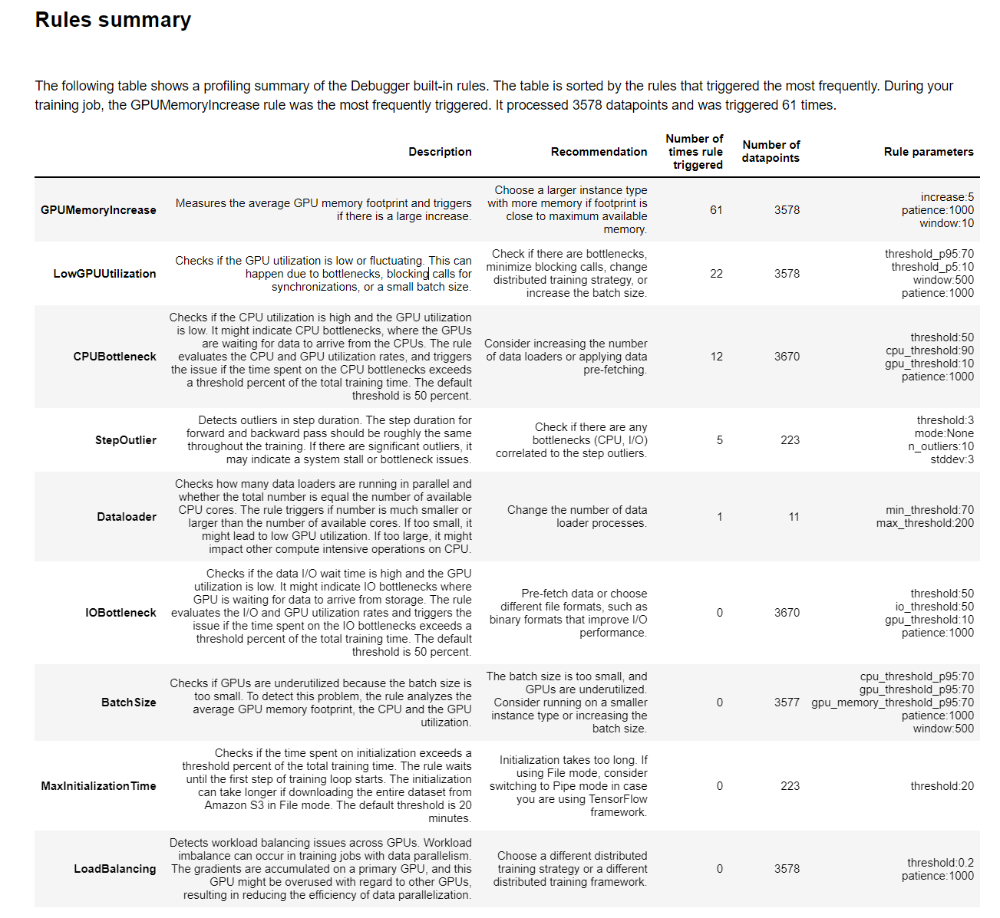
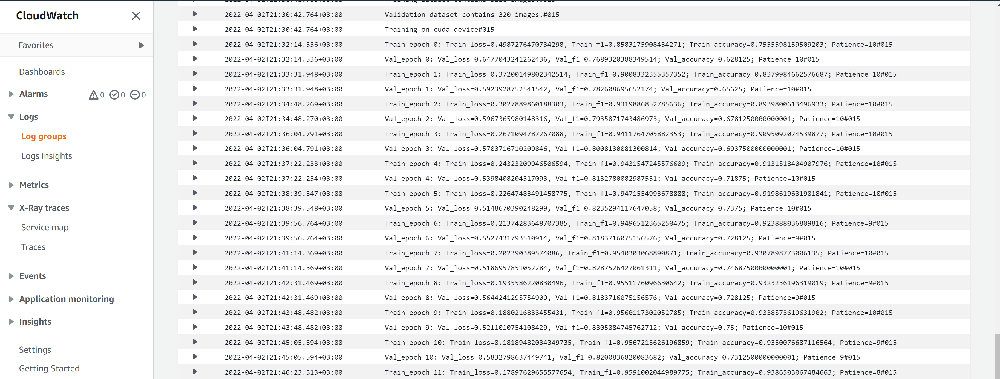
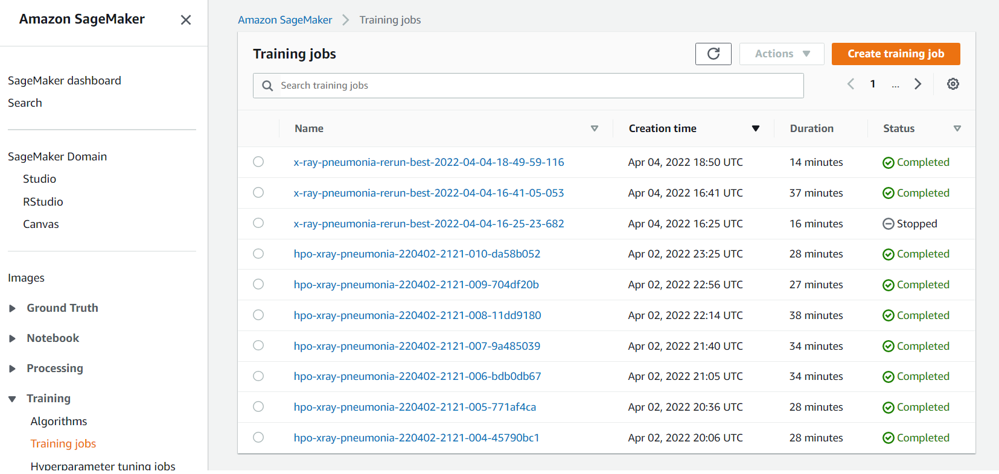
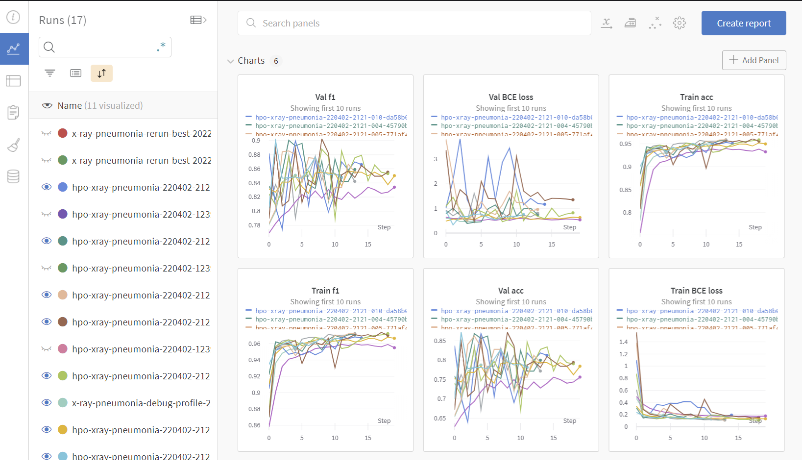
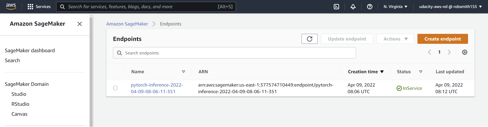
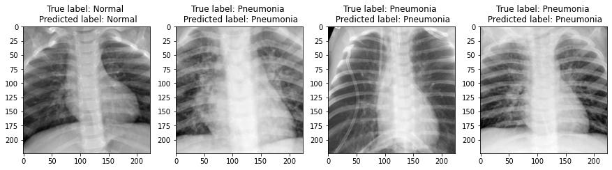
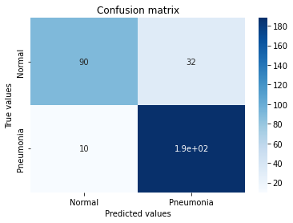

# Image Classification using AWS SageMaker

In this project, we work with the Kaggle [chest X-ray dataset](https://www.kaggle.com/paultimothymooney/chest-xray-pneumonia) for pneumonia identification to demonstrate how to use AWS Sagemaker for image classification. We will work with a number of Sagemaker tools, incluidng profiling, debugger, hyperparameter tuning and use other good ML engineering practices. This work is for the third project making up the [Udacity AWS ML Engineer](https://www.udacity.com/course/aws-machine-learning-engineer-nanodegree--nd189) nanodegree.

<p align="center">
    
</p>
<p align="center">
    <em>Project pipeline <a href="https://classroom.udacity.com/nanodegrees/nd189/parts/cd0387/modules/75b4168b-49f2-4e39-86b2-298678785675/lessons/a4361b1b-1f0a-4a61-a7de-ed9b6e2f542d/concepts/cff5deb6-89fb-47ae-af04-ba1b400856b3">(Source) </a> .</em>
</p>

The results for my project were tracked with Weights & Biases, which you can view [here](https://wandb.ai/robsmith155/udacity-nd_aws-ml-engineer_project3_xray-classification?workspace=user-robsmith155).

## Project Set Up and Installation
 

### Running the notebook
The notebook can either be run directly on SageMaker (through a SageMaker notebook instance or SageMaker Studio) or on your local machine. I prefer to run the notebook locally for a number of reasons:
- First, I often face issues with SageMaker notebooks when I download and extract a dataset (like we will do in this notebook). Often the notebook will become very slow and I've not been able to determine the cause.
- Secondly (and perhaps more importantly), I don't need to worry about accidentally leaving an instance running on SageMaker and incurring extra costs. 

Of course, there are a few downsides to running the notebook locally. For instance, we need to setup and manage our own Python environment, but this is not too difficult using tools such as [Miniconda](https://docs.conda.io/en/latest/miniconda.html).

**Note**: Rather than creating a virtual enviornment, the best way to run locally would be to use Docker and use the same PyTorch image that will be run by the training jobs. We can then have exactly the same environment and can test the model training locally rather than having to submit jobs and debug in SageMaker. I've not tried this yet, but [this](https://towardsdatascience.com/run-amazon-sagemaker-notebook-locally-with-docker-container-8dcc36d8524a) article provides an example of how things could be setup while this [notebook](https://github.com/aws/amazon-sagemaker-examples/blob/main/sagemaker-python-sdk/pytorch_cnn_cifar10/pytorch_local_mode_cifar10.ipynb) shows things running in local mode.

**Note:** While I run the notebook locally, the model training jobs and hyperparameter tuning are sent to be run on SageMaker managed instances.

### Run from local machine in VSCode
Here I am running the notebook through VS Code on my local machine using Ubuntu and my own Python virtual enviornment. I suggest to run on a Linux operating system as I faced issues when trying to run on Windows.

#### 1. Setup Python virtual environment
Make sure you have created a Python virtual environment using the `conda.yml` file provided in the repository.

```
conda env create -f environment.yml
```
#### 2. Configure AWS credentials
To be able to connect to your AWS account via VSCode, you first need to retrieve and store your credentials. To do this you should:

1. Install the AWS toolkit for Visual Studio Code (see [here](https://docs.aws.amazon.com/toolkit-for-vscode/latest/userguide/setup-toolkit.html))
2. Setup AWS credentials file (see [here](https://docs.aws.amazon.com/toolkit-for-vscode/latest/userguide/setup-credentials.html#setup-credentials-set-access-keys))

You should make sure that your credentials are associated with the corect AWS region. You can also refer to [this](https://towardsdatascience.com/setting-up-amazon-sagemaker-environment-on-your-local-machine-7329e0178adc) article for a useful walkthrough of running SageMaker locally.


### Running in SageMaker studio/notebook instance
You can try to run the notebook directly in a SageMaker notebook instance or SageMaker studio. You simply need to clone this repository and make sure you select one of the `Python 3 (PyTorch 1.8)` kernels.

In the notebook I try to highlight where you may need to do things differently to how I ran it on my local machine. 


## Dataset
In this project we will work with the chest X-ray dataset for indentifying pneumonia which is available on [Kaggle](https://www.kaggle.com/paultimothymooney/chest-xray-pneumonia). This is a binary classification task, where we either need to label the images as normal or pneumonia.

<p align="center">
    
</p>
<p align="center">
    <em>Sample X-ray images</em>
</p>

You can either download the data manually from the Kaggle page, or you can follow the instructions in the notebook to download it using the Kaggle CLI. If you download it manually, you should extract the files into a folder named `chest_xray` in the same directory as this notebook.

Note that the validation dataset provided by Kaggle was very small (only 16 images). In the notebook we move some of the images from the test dataset before uploading them to an S3 bucket.


## Model training 
In this work, we fine-tune a pretrained [ResNet18](https://arxiv.org/pdf/1512.03385.pdf) model. This is a deep convolutional neural network (CNN) that has had success on a wide range of computer vision tasks. The basic structure of this network is shown below:

<p align="center">
    
</p>
<p align="center">
    <em>Basic structure of ResNet18 architecture <a href="https://www.researchgate.net/publication/340644618_Transfer_Learning_with_Deep_Convolutional_Neural_Network_CNN_for_Pneumonia_Detection_using_Chest_X-ray">(Source) </a> .</em>
</p>

Note that since we have a binary classification problem, we remove the final linear classifier layer (which has 1000 outputs since ImageNet consists of 1000 classes) and replace it with a linear (i.e. fully connected) layer which goes to a single output node. Rather than start from random weight initialization, we will use the weights that have been trained on the [ImageNet](https://image-net.org/) dataset, meaning we start with a network that has already learned a rich set of image representations

### Training script
The model training script can be found in `./source_dir/train_model.py`. 

#### Parameters
Some of the parameters that can be passed to the `train_model` script include:

- `output_dir`: This is the path of the S3 directory where you want to store the outputs of the training job. Within the script, this is used to set the `SM_OUTPUT_DATA_DIR` environment variable. Once training is finished on the EC2 instance, the outputs will be copied to this location.
- `wandb_tracking`: If you want to track with W&B, follow the instructions provided in the notebook and set this argument to 'true' (string, not boolean. See next section) and the metrics of the training jobs will be automatically logged for you.
- `debugging`: Whether you want to run SageMaker debugging with the training job. Set this to 'true' (string, not Boolean) if you want to use it.
- `profiler`: Whether you want to run SageMaker profiling with the training job. Set this to 'true' (string, not Boolean) if you want to use it.
- `lr`: The learning rate to use for training. We will search different values for this during the hyperparameter search.
- `batch_size`: The batch size to use during training. We will also try different values for this during training.

#### Boolean parameters
It's worth mentioning the issue of using Boolean hyperparameters with SageMaker, since this is something that I found to be poorly documented. Initially I was including Boolean arguments with Argparse like shown below:

```
parser.add_argument(
        "--debugging",
        type=bool,
        default=False,
        help="Run debugging (default: False)"
    )
```
Initially I thought everything was fine as my script was running. However, I discovered in the AWS CloudWatch logs that these were always being picked up as `True`, even if I explicitly passed `False` to the argument. This issue is not well explained in the Sagemaker documentation, the only reference I can find is the following excerpt:

> Note that SageMaker doesn’t support argparse actions. If you want to use, for example, boolean hyperparameters, you need to specify type as bool in your script and provide an explicit True or False value for this hyperparameter when instantiating PyTorch Estimator. [Source](https://sagemaker.readthedocs.io/en/v2.21.0/frameworks/pytorch/using_pytorch.html)

I eventually found a workaround based in [this](https://github.com/awslabs/sagemaker-debugger/blob/master/examples/tensorflow/sagemaker_byoc/simple.py) example. In the training script I include the following function to convert certain strings to Booleans:

```
def str2bool(v):
    if isinstance(v, bool):
        return v
    if v.lower() in ("yes", "true", "t", "y", "1"):
        return True
    elif v.lower() in ("no", "false", "f", "n", "0"):
        return False
    else:
        raise argparse.ArgumentTypeError("Boolean value expected.")
```

Now we set the type of the parameter to be `str2bool` as follows:

```
parser.add_argument(
        "--debugging",
        type=str2bool,
        default=False,
        help="Run debugging (default: False)"
    )
```
We should then pass a valid string (such as 'true' or 'false'), depending on which Boolean we need.

```
hyperparameters={
        ...
        "debugging": 'false',
        ...}
```

I'm still not exactly clear on the issues behind this, but at least this seems to work for now.

### Debugging and Profiling
The hooks for SageMaker Debugger are built into the `train_model.py` script. We can set the `debugging` and `profiling` parameters to 'true' so that they will be taken care of during a training job. 

Aside from this, you also need to define:

- **profiler_config**: This configures the Debugger to collect system and framework metrics from the training job.
- **debugger_hook_config**: Configures Debugger to collect output tensors from the training job and save to the S3 bucket.
- **rules**: Here we can configure Debugger to enable built-in rules that automatically analyze the training job and find issues. 

See the section on debugging in the notebook for more details.

#### Debugger results
The generated report (PDF and notebook) can be found in `ProfilerReport/profiler-output`. A snapshot from the report is provided below. There are no major issues. The rule that was triggered the most is the `GPUMemeoryIncrease` check. This was triggered 61 times out of 3578 data points. It might be better to use a different instance type with a better GPU/larger memory, such as the `ml.p3.xlarge` instances. However, this will take time to setup since I need to request AWS support to add this to my available resources and will also cost more money. For now I will stick with the `ml.p2.xlarge` instance.

One thing sthat we can do is increase the number of workers available for the PyTorch DataLoader. For this test it was left at the default (0, meaning one it uses the main process), but I have four CPUs available on this instance type so we can increase the number of workers.

<p align="center">
    
</p>
<p align="center">
    <em>Screenshot of SageMaker debugging report.</em>
</p>

### Hyperparameter search
In this example, we just search over the learning rate and batch size, but typically we may include more parameters. 

```
hyperparameter_ranges = {
    "lr": ContinuousParameter(0.0001, 0.1),
    "batch_size": CategoricalParameter([32, 64, 128]),
}
```
For this example, I also only run it for 10 trials to keep the costs low. Ideally we would want to run for many more iterations.

#### Tracking metrics
The tuning job needs a performance metric to enable it to decide what parameters to try next (the search uses Bayesian optimization by default). During training we need to print this information to the AWS logs and then tell the hyperparameter tuner how to retrieve this information using regex expressions. 

As you can see below, I'm using the validation F1 score as my evaluation metric. In the `train_model.py` code, the following line is included to log the validation loss and metrics:

```
logger.info(f'Val_epoch {epoch}: Val_loss={val_loss}, Val_f1={val_f1}; Val_accuracy={val_acc}; Patience={_patience}')
```

An example of what the output of this looks like in the AWS Cloudwatch logs is shown below.

<p align="center">
    
</p>
<p align="center">
    <em>Example training log in AWS CloudWatch with validation loss and metrics.</em>
</p>


Some of the completed training jobs from the hyperparameter search are shown below.

<p align="center">
    
</p>
<p align="center">
    <em>Completed training jobs.</em>
</p>

#### Search results
You can view the results in my Weights & Biases [project](https://wandb.ai/robsmith155/udacity-nd_aws-ml-engineer_project3_xray-classification?workspace=user-robsmith155). An example screenshot is shown below.

<p align="center">
    
</p>
<p align="center">
    <em>Screenshot from the W&B project which was used to track the experiments.</em>
</p>

Note that SageMaker appears to record the validation metric from the last epoch as being the best score from that model (which may not be true, as evident from the screenshot above). According to SageMaker, the hyperparameters of the best model according to this criteria used a learning rate of 0.091 and batch size of 64.

## Model Deployment
The notebook provides three examples of how the model can be deployed.

### Real-time endpoint
The first method is to create an endpoint which can be invoked for rea-tiem inference. Within the notebook you will find two examples, the first which uses the default model serving functions, while the second uses custom functions.

#### Using default model serving functions
When we deploy the endpoint it will run a SageMaker PyTorch model server. As detailed [here](https://sagemaker.readthedocs.io/en/stable/frameworks/pytorch/using_pytorch.html), we can configure two parts of the inference process; model loading and model serving. This consists of four functions:
- `model_fn`: This tells SageMaker how to load your model and retsurns a model object that can be used for model serving. This must be provided by the user in all cases.
- `input_fn`: Takes the request data and prepares (deserializes) into the correct format for prediction
- `predict_fn`: Takes the output of `input_fn` (i.e. the deserialized request data) and performs inference using the model loaded with `model_fn`.
- `output_fn`: Takes the output of `predict_fn` and serializes the prediction according to the response content type.

At a minimum we must provide a `model_fn` function, which is what we will do for this first example. We can include this in the same script where we put the training code (i.e. `train_model.py`), but it's better to have it in its own script. Here the following is added to the `inference_default.py` script in the `source_dir` directory and used as the `entry_point` for the model.

```
def model_fn(model_dir):
    model = net()
    with open(os.path.join(model_dir, "model.pth"), "rb") as f:
        model.load_state_dict(torch.load(f))
    return model
```

You can find details for how to deploy this endpoint in the notebook. It may take a few minutes for the endpoint to be created, but once it is done you will be able to see a running endpoint in the AWS SageMaker console.

<p align="center">
    
</p>
<p align="center">
    <em>Example endpoint running on SageMaker.</em>
</p>

In this case, according to the SageMaker [documentation](https://sagemaker.readthedocs.io/en/stable/frameworks/pytorch/using_pytorch.html), the default `input_fn` will deserialize JSON, CSV or NPY encoded data into a torch.Tensor. So here we need to pass the input data as a NumPy array. Before we can do this we need to prepare the data by applying the relevant data transforms. See the notebook for further details on how to run this, but some example predictions are displayed below:

<p align="center">
    
</p>
<p align="center">
    <em>Example predictions from the SageMaker endpoint.</em>
</p>

#### Using custom model serving functions
Using the default `input_fn`, `predict_fn` and `output_fn` provided by AWS means that the end user then needs to prepare the data in the correct way before making the request. This makes it more likely for errors to occur. Also, if we want to perform batch predictions (which we will see next), we need to take care of the preprocessing in these functions. 

For the code for custom model serving can be found in the `inference_custom.py` file. When we send a request to an endpoint, the data should be in the form of a byte array. The `input_fn` should extract this from the request body and deserialize it into the correct form for making a prediction with the model. In this case, we are working with JPEG images, so the content type is `image/jpeg`. The input to the `predict_fn` should be a Pillow image, which we use to open the data in the request body.

```
def input_fn(request_body, content_type='image/jpeg'):
    logger.info('Deserializing input data')
    logger.info(f'Request content type: {type(request_body)}')
    if content_type == 'image/jpeg':
        logger.info('Loading image')
        return Image.open(io.BytesIO(request_body))
    elif content_type == 'application/json':
        img_request = requests.get(request_body['url'], stream=True)
        return Image.open(io.BytesIO(img_request.content))
    raise Exception(f'Unsupported content type ({type(request_body)}). Expected image/jpeg')
```

The output from this is passed to the `predict_fn`. Here I apply the transformations that need to be applied to the image before passing it through the model.

```
def predict_fn(input_object, model):
    logger.info('Starting predict function')

    device = torch.device('cuda' if torch.cuda.is_available() else 'cpu')
    model.eval()
    model.to(device)
    
    # Transform data
    test_transforms = transforms.Compose([
        transforms.Grayscale(num_output_channels=3),
        transforms.Resize(size=256),
        transforms.CenterCrop(size=224),
        transforms.ToTensor(),
        transforms.Normalize(mean=[0.485, 0.456, 0.406],
                            std=[0.229, 0.224, 0.225])
        ])

    logger.info('Passing data through image transformations')
    input_object = test_transforms(input_object)
    logger.info(f'Input mean: {np.mean(input_object.numpy().flatten())}')
    logger.info(f'Input std: {np.std(input_object.numpy().flatten())}')

    with torch.no_grad():
        logger.info(f'Making prediction on input object')
        logger.info(f'Input object type is {type(input_object)}')
        logger.info(f'Input object size is {input_object.shape}')
        prediction = model(input_object.unsqueeze(0).to(device).item())
        logger.info(f'Output from PyTorch model: {prediction}')
    
    return prediction
```

**Important**: Make sure to put the model in evaluation model (i.e. `model.eval()`), else you will get strange output predictions.

The `output_fn` is used to process the output from `predict_fn` into the correct content type for sending back the response from the endpoint. Here I am use the default function, which expects the output from `predict_fn` to be a `torch.Tensor` and can serialize the data as either JSON, CSV or NPY.

One final thing we need before deploying an endpoint with these custom inference functions is a function to call to create a predictor with an endpoint name and SageMaker session. To do this, we create the `ImagePredictor` class below, which inherits from the `Predictor` class. We then overide the input serializer and output deserializer to fit our use case.

```
jpeg_serializer = IdentitySerializer("image/jpeg")
numpy_deserializer = NumpyDeserializer()

class ImagePredictor(Predictor):
    def __init__(self, endpoint_name, sagemaker_session):
        super().__init__(endpoint_name, sagemaker_session=sagemaker_session, serializer=jpeg_serializer, 
                         deserializer=numpy_deserializer, content_type='image/jpeg')
```

Finally this used to create a deployed endpoint. See the notebook for how this was done. Note in this case we supply the raw image data in byte form when making a request.

### Batch transform
I also include an example of how to create a batch transform to make predictions for the full validation dataset. 

Below we can see the confusion matrix from the validation data that was processed using a batch transformation. 

<p align="center">
    
</p>
<p align="center">
    <em>Validation data confusion matrix.</em>
</p>

So out of the 320 validation images, 270 were correctly classified while 50 were misclassified. In this case, normal X-rays being classified as having pneumonia was more common (32 instances) than pneumonia X-rays misclassified as being normal. It's probably preferable that this is the case, rather than the other way around.

The corresponding validation F1 score is 0.90, while a naive model that just predicts all pneumonia X-rays would score 0.76. So we have a useful result, although there are still many things we can do to improve the model (see following section for suggestions). Once we are happy with the model then we should re-run the above analysis on the test data, but we don't want to keep doing this as we can then bias the results.

## Areas for improvement
Here we focused on developing an end-to-end workflow that allows us to upload our data to S3, run hyperparameter turning, and deploy the final model to a SageMaker endpoint. There are many things that we could do to try to improve the performance of the model, including:

- **Oversampling minority class**: We saw before that we have an imbalanced training dataset, with around three pneumonia X-rays for every normal image. One way we can try to account for this is to sample the normal X-rays multiple times until we have the same number as the pneumonia samples.
- **Weighted loss function**: I forgot to add a weighting to the loss function. This would penalize mistakes with the minority class (in this case normal X-rays) more than those with pneumonia. However, we need to consider this carefully. Maybe it is better if a normal X-ray is mis-classified as pneumonia, so at least a radiologist can look at it in more detail. This might be preferable to misclassifying an X-ray with signs of pneumonia as being normal.
- **Extend fine-tuning**: Currently the model training only updates the weights in the very final layer of the model (fully connected layer). However, we can also fine-tune early layers (i.e. the convolutional part) of the model.